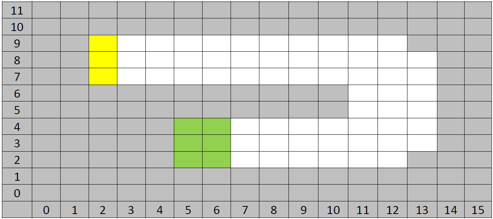

# MDP_racecar

This project implements the **Value Iteration algorithm** to solve a planning and scheduling problem for an autonomous car navigating a 2D race track. The task is part of the **"Planning and Scheduling"** course of the MSc in Artificial Intelligence and Data Analytics at the **University of Macedonia**.


## Problem Formulation

The task takes place in a discrete 2D grid environment defined by a set of obstacle-free cells, a start region (marked by a yellow line), and a goal region (marked by a green line). A state is represented as a tuple **(x, y, vx, vy)**, where **(x, y)** is the car's current position and **(vx, vy)** its velocity.



### State Dynamics

The velocity components **vx** and **vy** are bounded by a configurable maximum speed **v_max**, with: ```-v_max ≤ vx, vy ≤ v_max (default: v_max = 2)```
The car can adjust its velocity at each time step by applying an acceleration in each direction, bounded by a maximum value **a_max** (default: 1). The initial velocity is set to **(0, 0)**.

Acceleration attempts are stochastic: any non-zero change in speed (in either direction) succeeds with probability **p** (default: 0.8). If a failure occurs (with probability **1 - p**), the velocity remains unchanged in *both* directions, regardless of which components were targeted.

### Rewards and Penalties

The environment imposes the following reward structure:

- **+100** for reaching a goal cell.
- **-1** penalty per time step, regardless of speed.
- **-10** penalty for colliding with an obstacle. In such cases, the car remains in its previous position and its velocity is reset to zero.

### Parameterization

To enhance flexibility and generality, all critical simulation parameters are exposed as user-defined inputs:

- Maximum speed: `v_max`
- Maximum acceleration: `a_max`
- Discount factor: `gamma ∈ (0,1]`
- Acceleration success probability: `p ∈ (0,1]`
- Goal reward, time step penalty, and crash penalty

This design allows the same codebase to be reused under different environment configurations and control dynamics without requiring structural changes.
